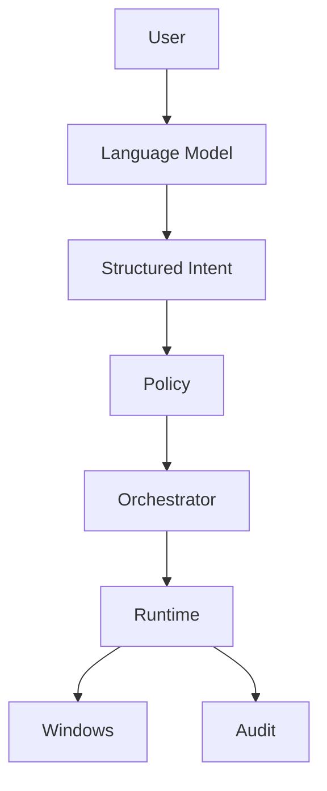

# Hammad Mir

 

I build practical systems across **IT infrastructure, security, automation and applied AI.**

 

[**hamad.no**](https://hamad.no)

 

## About

I am an IT consultant at **Sagene Data AS**, working with Microsoft environments, endpoint management, troubleshooting, security and automation.

I have completed studies in **Applied Machine Learning at Noroff** and enjoy combining traditional IT infrastructure with practical AI systems.

My focus is simple: build systems that are **reliable, understandable and secure**.

 

## Technology

  

**Microsoft 365 · Entra ID · Intune · Defender · Sentinel · Ollama**

 

## Current Focus

**Infrastructure**  
Microsoft 365 · Entra ID · Intune · Endpoint Management

**Security**  
Identity · Endpoint Security · Hardening · Monitoring · Defender

**Applied AI**  
Local AI · Agents · Machine Learning · Model Inference

 

## Raven Core

### Local AI with controlled execution

Raven Core is my personal AI system for Windows.

The project explores a simple question:

> **How can an AI assistant perform real actions on a computer while remaining predictable, observable and under the user's control?**

Instead of allowing the language model to directly control the operating system, Raven converts natural language into structured actions that move through explicit policy and execution boundaries.

**Local Inference · Intent Routing · Policy Enforcement**

**Deterministic Execution · Windows Automation · Audit Logging**

 

The model interprets what the user wants.

Deterministic components decide what the system is actually allowed to do.

This separation keeps reasoning flexible while execution remains controlled.

 

## Selected Projects

### Raven Core

A local personal AI system built around deterministic execution, explicit security boundaries, contextual memory and Windows automation.

**Rust · Local LLMs · Windows · Security · AI Agents**

 

### [Vault CLI](https://github.com/soldercore/vault-cli)

An offline password manager focused on strong local encryption and simple terminal based operation.

**PowerShell · Security · Encryption · Local Storage**

 

### [IT Support System Scanner](https://github.com/soldercore/IT-Support-System-Scanner)

A practical support tool for collecting system information and reducing repetitive troubleshooting work.

**PowerShell · Windows · IT Operations · Automation**

 

## How I Build

**Reliable over clever**

Consistency comes before unnecessary complexity.

 

**Secure by design**

Security belongs in the architecture from the beginning.

 

**Automation with purpose**

Automation should remove repetitive work without removing accountability.

 

**Local when possible**

Privacy, ownership and control matter.

 

## Interests

**Microsoft Infrastructure · Security Engineering · IT Automation**

**Local AI · AI Agents · Machine Learning**

**Windows · Linux · Networking · Privacy**

 

### More about my work

Projects, experience and background at

## [hamad.no](https://hamad.no)

 

**IT · Security · Automation · Applied AI**

