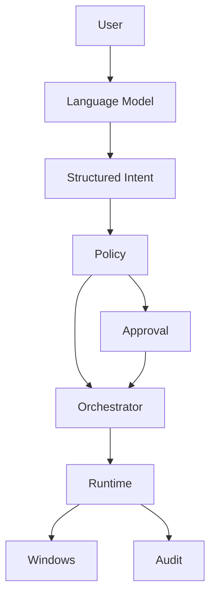

<div align="center">

# Hammad Mir


<br>

**Infrastructure · Security · Automation · Applied AI**

<br>

[**hamad.no**](https://hamad.no)

</div>

<br>

## `$ whoami`

```console
soldercore@github:~$ ./profile

NAME        Hammad Mir
ROLE        IT Consultant
FOCUS       Security · Automation · Applied AI
EDUCATION   Applied Machine Learning · Noroff
PROJECT     Raven Core
SYSTEM      Windows · Linux · Microsoft Cloud
```

I work as an IT consultant at **Sagene Data AS**, primarily with Microsoft environments, endpoint management, troubleshooting, security and automation.

I have completed **Applied Machine Learning at Noroff** and enjoy combining traditional infrastructure with practical AI systems.

```text
objective:
    build systems that are reliable
    understandable
    observable
    secure
```

<br>

## `$ stack`

```text
INFRASTRUCTURE

  Microsoft 365
  Entra ID
  Intune
  Microsoft Defender
  Windows
  Endpoint Management


SECURITY

  Identity Security
  Endpoint Security
  System Hardening
  Monitoring
  Networking
  VPN
  DNS
  Defensive Security


AUTOMATION

  PowerShell
  Python
  Bash
  Git
  System Integration


APPLIED AI

  Local LLMs
  Ollama
  Model Inference
  Intent Routing
  AI Agents
  Machine Learning
```

<br>

# `$ ./raven status`

```console
RAVEN CORE

STATE       ACTIVE
PLATFORM    WINDOWS
INFERENCE   LOCAL
EXECUTION   DETERMINISTIC
POLICY      FAIL CLOSED
APPROVALS   BOUNDED
AUDIT       ENABLED
MEMORY      CONTEXTUAL
```

### Raven Core

**A local AI system designed to interact with Windows without giving the language model unrestricted control.**

Most AI assistants are designed to produce answers.

Raven is being built to **perform real actions**.

That creates a different problem.

```text
UNDERSTAND
    │
    ▼
AUTHORIZE
    │
    ▼
EXECUTE
    │
    ▼
VERIFY
```

The model interprets what the user wants.

Trusted components decide what the system is actually allowed to do.

### `$ raven architecture`



### `$ raven capabilities`

```console
[ OK ] local model inference
[ OK ] structured intent routing
[ OK ] explicit policy enforcement
[ OK ] deterministic execution
[ OK ] approval boundaries
[ OK ] Windows automation
[ OK ] audit logging
[ OK ] contextual memory
[ OK ] multi step workflows
```

> **The model may reason about an action. Trusted components decide whether the action can happen.**

<details>
<summary><strong>Open architecture notes</strong></summary>

<br>

```text
USER
 │
 ▼
LANGUAGE MODEL
 │
 │  interpretation
 ▼
STRUCTURED INTENT
 │
 ▼
POLICY
 │
 │  allow
 │  deny
 │  approve
 ▼
ORCHESTRATOR
 │
 ▼
RUNTIME
 │
 ├──────────────► AUDIT
 │
 ▼
WINDOWS
```

**Language Model**

Interprets natural language and user intent.

**Structured Intent**

Transforms model output into typed operations.

**Policy**

Determines whether an operation may continue.

**Orchestrator**

Controls execution state and workflows.

**Runtime**

Performs approved operations.

**Audit**

Records system behavior and execution results.

The architecture keeps language reasoning separate from trusted execution.

</details>

<br>

## `$ ls projects`

```text
projects/

  raven_core/
  system_scanner/
  privacy_guide/
  bli_enig/
  automation_lab/
```

### `raven_core/`

Local personal AI system for Windows with controlled execution, policy enforcement, contextual memory and operating system automation.

`Rust` `Local LLMs` `Windows` `Security` `AI Agents`

<br>

### `system_scanner/`

Practical Windows support tooling designed to collect useful system information and reduce repetitive troubleshooting work.

`PowerShell` `Windows` `IT Operations` `Automation`

<br>

### `privacy_guide/`

Practical privacy guidance designed to help people reduce unnecessary digital exposure without requiring deep technical knowledge.

`Privacy` `DNS` `VPN` `Browsers` `Security`

<br>

### `bli_enig/`

An experiment in using software to structure disagreements, compare perspectives and make discussions clearer.

`React` `TypeScript` `Product Design`

<br>

## `$ cat current_focus`

```text
01  MICROSOFT INFRASTRUCTURE

    Microsoft 365
    Entra ID
    Intune
    Endpoint Management
    Secure Operations


02  DEFENSIVE SECURITY

    Identity
    Endpoint Security
    Hardening
    Monitoring
    Microsoft Defender


03  APPLIED AI

    Local Models
    Agents
    Machine Learning
    Model Inference
    AI System Architecture
```

<br>

## `$ cat principles.conf`

```ini
reliability     = required
security        = built_in
complexity      = justified
automation      = purposeful
privacy         = preferred
observability   = required
```

**Reliable over clever**

A system should behave consistently before it becomes complicated.

**Secure by design**

Security belongs in the architecture from the beginning.

**Automation with purpose**

Automation should remove repetitive work without removing accountability.

**Observable systems**

Important behavior should be understandable and inspectable.

**Local when possible**

Privacy, ownership and control matter.

<br>

## `$ git activity`

<picture>
  <source
    media="(prefers-color-scheme: dark)"
    srcset="https://github-readme-activity-graph.vercel.app/graph?username=soldercore&bg_color=0d1117&color=8b949e&line=3fb950&point=58a6ff&area=true&area_color=238636&hide_border=true&custom_title=Contribution%20activity"
  />
  <source
    media="(prefers-color-scheme: light)"
    srcset="https://github-readme-activity-graph.vercel.app/graph?username=soldercore&bg_color=ffffff&color=57606a&line=1a7f37&point=0969da&area=true&area_color=2da44e&hide_border=true&custom_title=Contribution%20activity"
  />
  
</picture>

<br>

## `$ github status`

<picture>
  <source
    media="(prefers-color-scheme: dark)"
    srcset="https://github-profile-summary-cards.vercel.app/api/cards/profile-details?username=soldercore&theme=github_dark&animation=sequence&duration=3"
  />
  <source
    media="(prefers-color-scheme: light)"
    srcset="https://github-profile-summary-cards.vercel.app/api/cards/profile-details?username=soldercore&theme=github&animation=sequence&duration=3"
  />
  
</picture>

<br>

## `$ interests`

```text
Microsoft Infrastructure     Security Engineering

IT Automation                Local AI

AI Agents                    Machine Learning

Windows                      Linux

Networking                   Privacy
```

<br>

```console
soldercore@github:~$ contact

web     https://hamad.no
status  ready
```

<div align="center">

### [hamad.no](https://hamad.no)

**Projects · Experience · Background**

<br>

`IT` · `SECURITY` · `AUTOMATION` · `APPLIED AI`

</div>