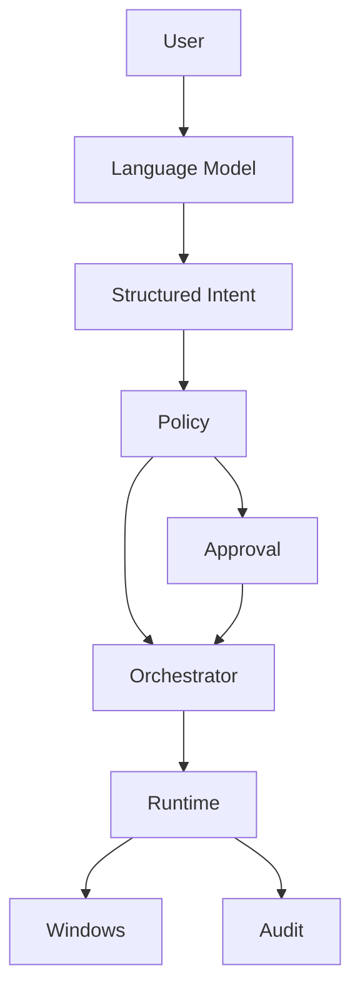

<div align="center">

# Hammad Mir

`IT CONSULTANT` · `SECURITY` · `AUTOMATION` · `APPLIED AI`

<br>

**Building reliable systems across infrastructure, security and artificial intelligence.**

[hamad.no](https://hamad.no)

</div>

<br>

```text
hammad@soldercore:~$ whoami

Hammad Mir
IT Consultant
Applied Machine Learning graduate

Current environment:
  Microsoft infrastructure
  Endpoint management
  Security
  Automation
  Local AI
```

<br>

## `$ cat about.txt`

I work as an IT consultant at **Sagene Data AS**, primarily with Microsoft environments, endpoint management, troubleshooting, security and automation.

I have completed **Applied Machine Learning at Noroff** and spend much of my personal development time exploring how traditional infrastructure can be combined with practical AI systems.

```text
principles.conf

reliability      = required
security         = built_in
complexity       = justified
automation       = purposeful
privacy          = preferred
observability    = required
```

<br>

## `$ stack --active`

```text
INFRASTRUCTURE
├── Microsoft 365
├── Entra ID
├── Intune
├── Microsoft Defender
├── Windows
└── Endpoint Management

SECURITY
├── Identity Security
├── Endpoint Security
├── System Hardening
├── Monitoring
├── Networking
├── VPN / DNS
└── Defensive Security

AUTOMATION
├── PowerShell
├── Python
├── Bash
├── Git
└── System Integration

APPLIED AI
├── Local LLMs
├── Ollama
├── Model Inference
├── Intent Routing
├── AI Agents
└── Machine Learning
```

<br>

# `$ ./raven-core`

```text
STATUS     ACTIVE
PLATFORM   WINDOWS
MODE       LOCAL FIRST
CONTROL    DETERMINISTIC
POLICY     FAIL CLOSED
AUDIT      ENABLED
```

## Raven Core

**A local AI system designed to interact with Windows without giving the language model unrestricted control.**

Most assistants stop at generating an answer.

Raven explores what happens when the assistant is allowed to **act**.

The important part is not making the model more powerful.

The important part is controlling what happens between:

```text
"I understand what you want"
             │
             ▼
"I am allowed to do it"
             │
             ▼
"I executed it correctly"
```

### Execution path



```text
raven@core:~$ capabilities --summary

[✓] Local model inference
[✓] Structured intent routing
[✓] Explicit policy enforcement
[✓] Deterministic execution
[✓] Approval boundaries
[✓] Windows automation
[✓] Audit logging
[✓] Contextual memory
[✓] Multi step workflows
```

### Design rule

> The model may reason about the action.  
> Trusted components decide whether the action can happen.

That separation allows Raven to remain flexible at the language layer while keeping execution bounded, observable and testable.

<details>
<summary><strong>View architecture notes</strong></summary>

<br>

```text
┌─────────────────────┐
│        USER         │
└──────────┬──────────┘
           │
           ▼
┌─────────────────────┐
│   LANGUAGE MODEL    │
│ interpretation only │
└──────────┬──────────┘
           │
           ▼
┌─────────────────────┐
│  STRUCTURED INTENT  │
└──────────┬──────────┘
           │
           ▼
┌─────────────────────┐
│       POLICY        │
│ allow / deny / ask  │
└──────────┬──────────┘
           │
           ▼
┌─────────────────────┐
│    ORCHESTRATOR     │
└──────────┬──────────┘
           │
           ▼
┌─────────────────────┐
│       RUNTIME       │
│ trusted execution   │
└──────┬────────┬─────┘
       │        │
       ▼        ▼
   WINDOWS    AUDIT
```

Raven is intentionally divided into components with narrow responsibilities.

**Language Model**

Interprets natural language.

**Structured Intent**

Turns model output into typed operations.

**Policy**

Decides what may proceed.

**Orchestrator**

Controls state and workflow execution.

**Runtime**

Executes approved operations.

**Audit**

Records what happened.

</details>

<br>

## `$ ls ~/projects`

### `raven-core/`

Local personal AI system for Windows with controlled execution, memory, policy enforcement and OS automation.

`Rust` `Local LLMs` `Windows` `Security` `AI Agents`

<br>

### `system-scanner/`

Windows support tooling designed to collect useful diagnostic information and reduce repetitive troubleshooting.

`PowerShell` `Windows` `IT Operations` `Automation`

<br>

### `privacy-guide/`

Practical privacy guidance designed for people who want stronger digital privacy without becoming security engineers.

`Privacy` `DNS` `VPN` `Browsers` `Security`

<br>

### `bli-enig/`

An experiment in using software to structure disagreements, compare perspectives and make discussions clearer.

`React` `TypeScript` `Product Design`

<br>

## `$ cat current_focus`

```text
01  MICROSOFT INFRASTRUCTURE

    Microsoft 365
    Entra ID
    Intune
    Endpoint Management


02  DEFENSIVE SECURITY

    Identity
    Endpoint Security
    Hardening
    Monitoring


03  APPLIED AI

    Local models
    Agents
    Machine Learning
    AI system architecture
```

<br>

## `$ cat engineering.md`

### `01 / reliable_over_clever`

A system should behave consistently before it becomes complicated.

### `02 / secure_by_design`

Security belongs in the architecture from the beginning.

### `03 / automation_with_purpose`

Automation should remove repetitive work without removing accountability.

### `04 / observable_systems`

Important behavior should be understandable and inspectable.

### `05 / local_when_possible`

Privacy, ownership and control matter.

<br>

## `$ interests`

```text
Microsoft Infrastructure    Security Engineering
IT Automation               Local AI
AI Agents                   Machine Learning
Windows                     Linux
Networking                  Privacy
```

<br>

```text
hammad@soldercore:~$ contact --web

Opening https://hamad.no ...
```

<div align="center">

## [hamad.no](https://hamad.no)

**Projects · Experience · Background**

<br>

`IT` · `SECURITY` · `AUTOMATION` · `APPLIED AI`

</div>