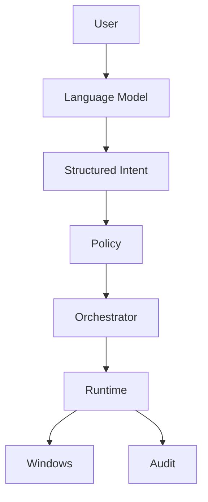

# Hammad Mir

 

I build practical systems across **IT infrastructure, security, automation and applied AI.**

 

### [hamad.no](https://hamad.no)

 

## About

I am an IT consultant at **Sagene Data AS**, working with Microsoft environments, endpoint management, troubleshooting, security and automation.

I have completed studies in **Applied Machine Learning at Noroff** and enjoy combining traditional IT infrastructure with practical AI systems.

My focus is simple:

**Build systems that are reliable, understandable and secure.**

 

## Technology

<code>Windows</code>
<code>Microsoft 365</code>
<code>Azure</code>
<code>Entra ID</code>
<code>Intune</code>
<code>Defender</code>

  

<code>PowerShell</code>
<code>Python</code>
<code>Rust</code>
<code>TypeScript</code>
<code>React</code>
<code>Linux</code>

  

<code>Ollama</code>
<code>Local LLMs</code>
<code>Git</code>
<code>Automation</code>
<code>AI Agents</code>
<code>Machine Learning</code>

 

## What I Work With

### Microsoft and Infrastructure

Microsoft 365 · Entra ID · Intune · Microsoft Defender · Windows · Endpoint Management · Identity and Access

### Security

Endpoint Security · Identity Security · System Hardening · Monitoring · Networking · VPN · DNS · Defensive Security

### Automation

PowerShell · Python · Bash · Git · System Integration · Automation Workflows

### Applied AI

Local LLMs · Ollama · Model Inference · Intent Routing · AI Agents · Machine Learning · AI System Architecture

 

## Raven Core

### Local AI with controlled execution

Raven Core is my personal AI system for Windows.

The project explores a simple question:

> **How can an AI assistant perform real actions on a computer while remaining predictable, observable and under the user's control?**

Instead of allowing the language model to directly control the operating system, Raven converts natural language into structured actions that move through explicit policy and execution boundaries.

<code>Local Inference</code>
<code>Intent Routing</code>
<code>Policy Enforcement</code>

  

<code>Deterministic Execution</code>
<code>Windows Automation</code>
<code>Audit Logging</code>

  

<code>Memory</code>
<code>Security Boundaries</code>
<code>Local AI</code>

 

The model interprets what the user wants.

Deterministic components decide what the system is actually allowed to do.

This separation keeps reasoning flexible while execution remains controlled.

<strong>Architecture</strong>

 

Raven is structured as separate components with clear responsibilities.

**Language Model**

Interprets natural language and user intent.

**Structured Intent**

Converts model output into typed actions the rest of the system can understand.

**Policy**

Determines whether an action is allowed, rejected or requires approval.

**Orchestrator**

Controls the execution flow and coordinates actions.

**Runtime**

Performs approved operations on the operating system.

**Audit**

Records what happened and makes system behavior observable.

The goal is to keep model reasoning separate from trusted execution.

 

## Other Projects

### IT Support System Scanner

A practical Windows support tool for collecting system information and reducing repetitive troubleshooting work.

`PowerShell` · `Windows` · `IT Operations` · `Automation`

 

### Privacy Guide

A practical project focused on helping people improve their digital privacy without requiring deep technical knowledge.

`Privacy` · `DNS` · `VPN` · `Browsers` · `Security`

 

### Bli Enig

A project exploring how software can help people structure disagreements, compare perspectives and reach clearer decisions.

`React` · `TypeScript` · `Product Design` · `User Experience`

 

### Lab and Automation Projects

I also experiment with Raspberry Pi systems, networking, local AI inference, Windows and Linux, system hardening, scripting and hardware integration.

 

## Current Focus

### Infrastructure

Microsoft 365 · Entra ID · Intune · Endpoint Management · Secure Operations

### Security

Identity · Endpoint Security · Monitoring · Hardening · Defensive Security

### Applied AI

Local AI · Agents · Machine Learning · Model Inference · AI Architecture

 

## How I Build

### Reliable over clever

A system should behave consistently before it becomes complicated.

### Secure by design

Security should be part of the architecture from the beginning.

### Automation with purpose

Automation should remove repetitive work without removing accountability.

### Understandable systems

Important behavior should be observable and explainable.

### Local when possible

Privacy, ownership and control matter.

 

## Interests

**Microsoft Infrastructure · Security Engineering · IT Automation**

 

**Local AI · AI Agents · Machine Learning**

 

**Windows · Linux · Networking · Privacy**

  

## More About My Work

Projects, experience and background at

### [hamad.no](https://hamad.no)

 

**IT · Security · Automation · Applied AI**

